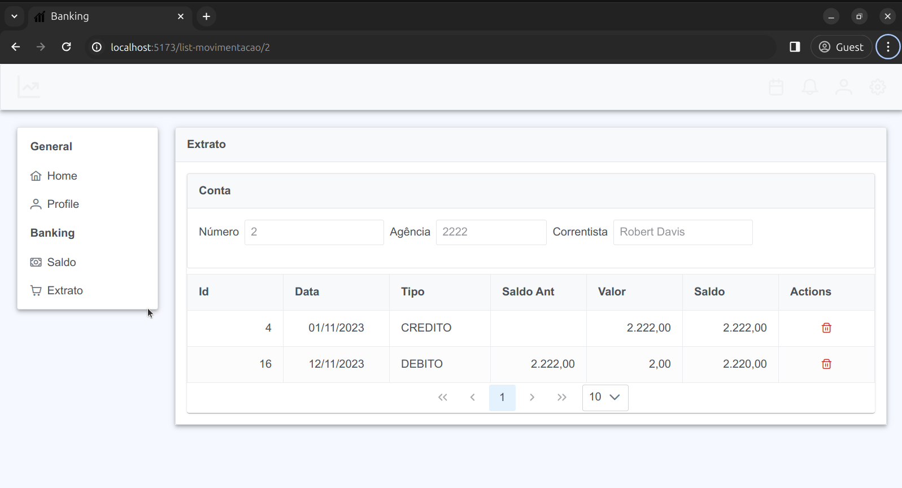

# ui-vue-banking
[](https://github.com/schambeck/vue-banking/actions/workflows/node.js.yml)

## Description

Banking User Interface.

  

## Tech Stack

- VueJS, Composition API
- PrimeVue, PrimeFlex

## Project Setup

```sh
npm install
```

### Compile and Hot-Reload for Development

Open http://localhost:5173

```sh
npm run dev
```

### Type-Check, Compile and Minify for Production

```sh
npm run build
```
